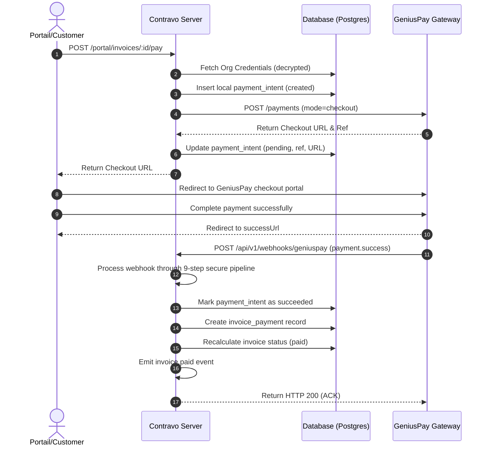

# GeniusPay Payment Integration

This document outlines the design, architecture, and end-to-end flow of the GeniusPay payment gateway integration.

## Overview

The GeniusPay integration enables tenants/organizations to accept customer payments via Mobile Money and Credit Cards. Each organization configures its own credentials (multi-tenant credentials), and payments go directly to the merchant's GeniusPay account.

## Database Schema & Models

The integration relies on three main tables:

1. **`payment_gateway_credentials`**: Stores encrypted `api_secret` and `webhook_secret` using AES-256-GCM.
2. **`payment_intents`**: Tracks payment initiations, amounts, currencies, and gateways references.
3. **`payment_webhook_events`**: Immutable audit log of all incoming webhook payloads, signature validation status, and processing errors.

---

## The 9-Step Webhook Security Pipeline

Incoming webhook events received at `/api/v1/webhooks/geniuspay` go through the following steps to ensure integrity and multi-tenant safety:

1. **Immediate Logging**: The event is immediately inserted into `payment_webhook_events` as unverified to ensure auditability, even if processing fails later.
2. **Timestamp Verification**: Checks if the timestamp header is within 300 seconds of the current server time to prevent replay attacks.
3. **Tenant Resolution**: Resolves the organization context from the `metadata.organization_id` payload field.
4. **Credential Fetching**: Fetches the decrypted `webhook_secret` for the resolved organization.
5. **Signature Verification**: Verifies the HMAC-SHA256 signature using `crypto.timingSafeEqual` to avoid timing side-channel attacks.
6. **Idempotency Check**: Unique constraint on `(provider, event_id)` stops duplicate webhook payloads from running business logic multiple times.
7. **Gateway Re-fetching**: Re-queries the GeniusPay API via `GET /payments/{reference}` using the organization's API credentials. This prevents spoofed payloads even if the webhook secret is compromised.
8. **Amount & State Verification**: Validates that the re-fetched payment amount matches the local intent amount.
9. **Business Logic & Persistence**:
   - Updates the `payment_intent` to `succeeded`.
   - Records the payment on the invoice (`invoice_payments`).
   - Updates the invoice status (e.g., to `paid` or `partial`).
   - Emits internal and external webhook events (`invoice.paid`).
